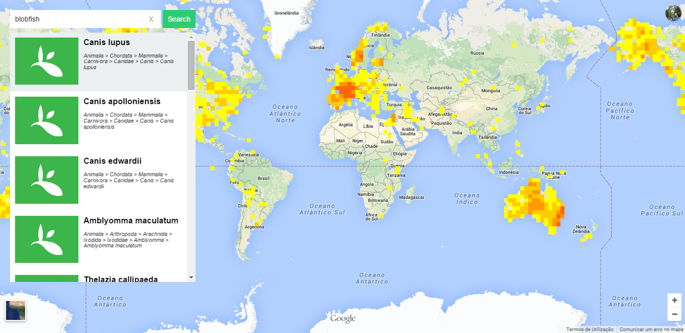

# GBIF Species Map

A simple map of species that combines the [GBIF Data API](http://www.gbif.org/developer/summary) with Google Maps, using AngularJS and some other cool stuff.

Demo: http://anpa.github.io/gbif-species-map/

## Instalation

1. Run `npm install`
2. Run `bower install`
3. Run `gulp start`

## Toolbox

This project uses:

* NPM
* Bower
* AngularJS
* Browserify
* Gulp
* SASS

## TO-DO

* Unit testing
* Documentation
* Fetch species images
* Add gulp tasks for production (minify CSS, JS)